# Refactoring Plan: Natural Language ↔ DFT Program Framework

## Target Architecture

```
User / Agent (natural language)
        │
        ▼
┌─────────────────────────────────┐
│         dft CLI (shared)        │
│  dft vasp search "..."          │
│  dft omx gen input.cif          │
│  dft convert vasp:omx INCAR     │
│  dft --list-codes               │
└──────────┬──────────────────────┘
           │ plugin registry
           ▼
┌──────────────────────────────────────────────────────────┐
│                   dft_utils/ (framework)                  │
│  search.py     — Generic hybrid search (FTS5+semantic)   │
│  cli.py        — Plugin loader, shared argparser         │
│  aliases.py    — AliasStore with cache+merge             │
│  error.py      — make_error(), die_json(), suggestion    │
│  fts5.py       — make_fts5_query()                       │
│  version.py    — DATA_VERSION, load_data with envelope   │
│  protocol.py   — DftCodePlugin protocol                  │
└──────┬───────────────────────────────────┬───────────────┘
       │                                   │
       ▼                                   ▼
┌──────────────┐                 ┌──────────────────┐
│ vasp_query/  │                 │  omx_tools/      │
│ plugin.py    │                 │  plugin.py       │
│   name: vasp │                 │    name: omx     │
│   search()   │                 │    search()      │
│   tag()      │                 │    gen()         │
│   stats()    │                 │    convert_to()  │
│   ...        │                 │    convert_from()│
└──────┬───────┘                 └────────┬─────────┘
       │                                  │
       └──────────────┬───────────────────┘
                      ▼
          ┌─────────────────────┐
          │   schemas/*.json    │
          │  vasp_to_ase.json   │
          │  (future pairs)     │
          └─────────────────────┘
```

## Principles

- **Incremental, not big-bang.** Each phase is independently commit-able and doesn't break existing CLI.
- **Backward compat.** Old entry points (`python3 -m vasp_query`, `omx-db`, `omx-gen`) keep working throughout.
- **Plugin protocol is opt-in.** Existing packages work without it; the protocol is for discovery and the unified `dft` CLI.

---

## Phase 0: Quick wins — dft_utils consolidation (1–2 hours)

**Goal: eliminate the small duplicated helpers that are trivially extractable.**

| Task | What | LOC saved |
|------|------|-----------|
| 0.1 | Move `_common.py:load_data()` (version envelope) → `dft_utils/version.py`. Replace omx_tools's inline `check_version()`. | ~50 |
| 0.2 | Move `_common.py:match_keyword()`, `score_keyword()` → `dft_utils/search.py`. Both packages use these. | ~30 |
| 0.3 | Add `make_fts5_query(keyword: str) → str` to `dft_utils/fts5.py`. Replace 3 inline copies. | ~9 |
| 0.4 | Remove `omx_tools/_utils.py:die_json()` (duplicates `dft_utils.die_json()`). Update imports. | ~12 |
| 0.5 | Add `dft_utils/error.py` with `make_error(msg, suggestion, debug)` that returns a dict. Both packages build these inline ~50 times. Add `make_suggestion_response(msg, suggestion, ...)` helper. | ~40 |

**Total savings: ~140 LOC.** All mechanical, no design decisions.

### Files touched
- `dft_utils/version.py` (new) — `load_data()`, `DATA_VERSION`, `check_version()`
- `dft_utils/search.py` (new) — `match_keyword()`, `score_keyword()`
- `dft_utils/fts5.py` (new) — `make_fts5_query()`
- `dft_utils/error.py` (new) — `make_error()`, `make_suggestion_response()`
- `dft_utils/__init__.py` — re-export for backward compat
- `vasp_query/_common.py` — redirect imports
- `omx_tools/_utils.py` — remove `die_json()`
- `omx_tools/database.py` — use `make_error()`, `make_fts5_query()`
- `omx_tools/generator.py` — `dft_utils.die_json()` instead of `_utils.die_json()`

---

## Phase 1: Shared hybrid search engine (2–3 hours)

**Goal: single `hybrid_search()` in dft_utils that both packages call, eliminating the 370 LOC duplication.**

### Architecture

```python
# dft_utils/search.py

class HybridConfig(BaseModel):
    fts5_db_path: Path
    fts5_table: str                    # e.g. "search_index" or "sections_fts"
    fts5_columns: list[str]            # columns to SELECT + MATCH
    semantic_model_name: str = "BAAI/bge-small-en-v1.5"
    rrf_k: int = 60
    top_k: int = 10
    tag_boost: float = 1.0             # extra weight multiplier for primary corpus
    debug_log: Callable = lambda _: None

def hybrid_search(
    keyword: str,
    config: HybridConfig,
    semantic_backend: str = "subprocess",  # or "inprocess"
) -> list[dict]:
    ...
```

### Backend differences to bridge

| | vasp_query | omx_tools |
|---|---|---|
| FTS5 table | `search_index` | `sections_fts` |
| Semantic model | In-process (cached global) | Subprocess (spawns python -c) |
| Tag boost | 1.5× for tag-only corpus | 1.0× |
| RRF merge key | `doc_id` | `sec_num:title` |
| Debug log | module-level `debug_log()` | same, but from `dft_utils` |

The shared function takes a config and adapts behavior. Each package's existing `hybrid_search` wrapper becomes ~10 lines delegating to `dft_utils.search.hybrid_search()`.

### Files touched
- `dft_utils/search.py` — `HybridConfig`, `hybrid_search()`, `_search_fts5()`, `_search_semantic_subprocess()`, `_search_semantic_inprocess()`
- `vasp_query/_common.py` — `hybrid_search()` shrinks to wrapper
- `omx_tools/database.py` — `cmd_hybrid()` + `_search_fts5()` + `_search_semantic()` replaced by `HybridConfig` + `hybrid_search()`

### Risk
- omx_tools's subprocess backend requires `os.environ['TF_CPP_MIN_LOG_LEVEL']` and specific argv setup. The shared implementation must preserve that.
- vasp_query's in-process backend needs the global model cache (`_MODEL_CACHE`). The shared version should handle both modes.

---

## Phase 2: Plugin protocol (1–2 hours)

**Goal: define a typed contract that any DFT code package can implement.**

```python
# dft_utils/protocol.py

@dataclass
class CodePlugin:
    """Registration record for a DFT code plugin."""
    name: str                          # "vasp", "omx", "castep"
    display_name: str                  # "VASP", "OpenMX", "CASTEP"
    description: str
    version: str
    skills: list[Path]                 # paths to SKILL.md files

    # Entry points
    cli_module: str                    # "vasp_query.query" (for `dft vasp ...`)
    search_fn: Callable | None = None  # search(keyword) → list[dict]
    generators: list[str] = field(default_factory=list)   # ["omx-gen"]
    converters: list[tuple[str, str]] = field(default_factory=list)  # [("vasp", "omx")]

# Registry
_registry: dict[str, CodePlugin] = {}

def register(plugin: CodePlugin) -> None: ...
def get_code(name: str) -> CodePlugin | None: ...
def list_codes() -> dict[str, CodePlugin]: ...

# Package discovery: looks for omx_tools/plugin.py, vasp_query/plugin.py
def discover_packages() -> dict[str, CodePlugin]: ...
```

### Plugin registration example

```python
# vasp_query/plugin.py (new)
from dft_utils.protocol import CodePlugin, register

plugin = CodePlugin(
    name="vasp",
    display_name="VASP",
    description="VASP INCAR parameter knowledge base",
    version="0.3.0",
    skills=[Path("skills/vasp-query/SKILL.md")],
    cli_module="vasp_query.query",
    generators=[],
    converters=[("vasp", "omx")],
)
register(plugin)
```

```python
# omx_tools/plugin.py (new)
plugin = CodePlugin(
    name="omx",
    display_name="OpenMX",
    ...
    cli_module="omx_tools.database",
    generators=["omx-gen"],
    converters=[("omx", "vasp")],
)
register(plugin)
```

### Files touched
- `dft_utils/protocol.py` (new) — `CodePlugin`, registry, discovery
- `vasp_query/plugin.py` (new) — registers VASP plugin
- `omx_tools/plugin.py` (new) — registers OpenMX plugin

---

## Phase 3: Unified `dft` CLI (2–3 hours)

**Goal: `dft vasp search "..."` works, alongside existing entry points.**

```
Usage: dft <code> <command> [options]

Codes:
  vasp    VASP INCAR parameter knowledge base
  omx     OpenMX input generator and manual database

Commands (varies per code):
  dft vasp tag ENCUT
  dft vasp search "energy cutoff"
  dft omx search "SCF convergence"
  dft omx gen structure.cif -t scf_band

Global:
  dft convert <src_code>:<dst_code> <input> [options]
  dft --list-codes
```

### Implementation

```python
# dft_utils/cli.py (new)

def build_parser(plugins: dict[str, CodePlugin]) -> argparse.ArgumentParser:
    """Build a unified CLI with per-code subparsers."""
    parser = argparse.ArgumentParser(prog="dft")
    parser.add_argument("--list-codes", action="store_true")
    parser.add_argument("--version", action="version", version=f"dft-tools {DATA_VERSION}")

    subparsers = parser.add_subparsers(dest="code")

    for name, plugin in plugins.items():
        code_parser = subparsers.add_parser(name, help=plugin.description)
        # Each plugin gets its own sub-subparsers
        # Plugin's cli_module handles dispatch
        ...
```

This is the most complex phase. Each `CodePlugin` needs to map its native CLI into the unified structure. The simplest approach: `dft vasp tag ENCUT` → `python3 -m vasp_query tag ENCUT` under the hood, via `plugin.cli_module`.

### Backward compat
- `python3 -m vasp_query` still works (no change to `__main__.py`)
- `omx-db` still works (entry point in pyproject.toml kept)
- `dft` is additive — new way to access the same functionality

### Entry point addition

```toml
[project.scripts]
dft = "dft_utils.cli:main"
```

### Files touched
- `dft_utils/cli.py` (new) — `build_parser()`, `main()`
- `pyproject.toml` — add `dft` entry point

---

## Phase 4: Extensible mapping layer (1–2 hours)

**Goal: `dft convert vasp:omx INCAR` works, mappings live in `schemas/` and are extensible.**

### Current state
- `omx_tools/schemas/vasp_to_ase.json` — 27 VASP→ASE mapping rules
- `omx_tools/mapping/__init__.py` — `forward()` / `reverse()` functions

### Target

```python
# dft_utils/convert.py (new)

# Mapping registry: (src_code, dst_code) → mapping_schema_path
_mappings: dict[tuple[str, str], Path] = {
    ("vasp", "omx"): PKG_DIR / "schemas" / "vasp_to_omx.json",
    ("omx", "vasp"): PKG_DIR / "schemas" / "omx_to_vasp.json",
}

def convert(
    src_code: str,
    dst_code: str,
    input_path: str,
    structure_path: str = "",
) -> str:
    """Convert an input file from src_code format to dst_code format.
    
    Returns path to generated output file.
    """
    ...
```

### Changes
- Move `schemas/` to root level (shared between packages)
- Rename `vasp_to_ase.json` → `vasp_to_omx.json` (more honest naming)
- Move `omx_tools/mapping/` → `dft_utils/convert.py`
- Each `CodePlugin` declares `converters=[("vasp","omx")]`

### Files touched
- `dft_utils/convert.py` (new) — `convert()`, mapping registry
- `schemas/vasp_to_omx.json` (moved from `omx_tools/schemas/`)
- `omx_tools/mapping/` — moved into `dft_utils/convert.py`
- `omx_tools/vasp2omx.py` — use `dft_utils.convert()`
- `omx_tools/omp2vasp.py` — use `dft_utils.convert()`

---

## Phase 5: Template + docs for adding new DFT codes (1 hour)

**Goal: clear guide so adding CASTEP/QE/FHI-aims is mechanical.**

### Deliverables

1. **`docs/ADDING_A_CODE.md`** — step-by-step walkthrough:
   - Create package skeleton (`castep_tools/`)
   - Index the manual → FTS5 DB + embeddings
   - Write parsers/writers
   - Create `plugin.py`
   - Register Skill
   - Test with `dft castep search "..."`

2. **`dft_utils/templates/code_skeleton/`** — copyable scaffold:
   - `__init__.py`
   - `plugin.py`
   - `parsers/`
   - `writers/`
   - `data/`
   - `tests/conftest.py`
   - `SKILL.md`

3. **Update `AGENTS.md`** — include "extending the framework" section

### Files touched
- `docs/ADDING_A_CODE.md` (new)
- `dft_utils/templates/` (new)
- `AGENTS.md` — extend section

---

## Summary

```mermaid
gantt
    title Refactoring Phases
    dateFormat  X
    axisFormat %d
    
    section Phase 0: Quick wins
    0.1-0.5 dft_utils consolidation : 0, 3d
    
    section Phase 1: Shared search
    Hybrid search extraction   : 3, 5d
    
    section Phase 2: Protocol
    Plugin protocol + registry : 8, 3d
    
    section Phase 3: Unified CLI
    dft CLI                    : 11, 5d
    
    section Phase 4: Mapping
    Extensible conversion      : 16, 3d
    
    section Phase 5: Docs
    Template + ADDING_A_CODE.md: 19, 2d
```



| Phase | What | Effort | LOC saved/deduplicated |
|-------|------|--------|------------------------|
| 0 | dft_utils consolidation | 1–2h | ~140 |
| 1 | Shared hybrid search | 2–3h | ~370 |
| 2 | Plugin protocol | 1–2h | ~60 |
| 3 | Unified `dft` CLI | 2–3h | — (new code) |
| 4 | Extensible mapping | 1–2h | ~60 |
| 5 | Template + docs | 1h | — (new docs) |
| **Total** | | **8–13h** | **~630** |

### Each phase is independently commit-able
- After Phase 0: dft_utils is the real shared library
- After Phase 1: both packages use the same search engine
- After Phase 2: plugin registry exists but no unified CLI yet
- After Phase 3: `dft` CLI works, old entry points still work
- After Phase 4: `dft convert` replaces `vasp2omx`/`omp2vasp`
- After Phase 5: framework ready for third-party contributions
